**说明：**

实验环境：Ubuntu18.04

我的虚拟机的名字：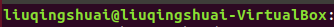

# 实验一、配环境和HelloWorld

### 1.1-**下载安装工具**

下载flex和bison->`sudo apt-get install flex bison`


检验安装是否成功，通过查看版本

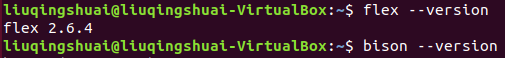

### 1.2-编译hello_world程序

编译以后，`examples`文件夹会多出一个`hello_world.s`的文件，

```
./coolc ../examples/hello_world.cl
```

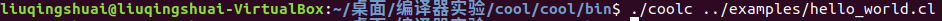

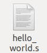

`hello_world.s`的文件里边装着MIPS汇编代码，需要在spim下运行

```
./spim -trap_file ../lib/trap.handler -file ../examples/hello_world.s
```

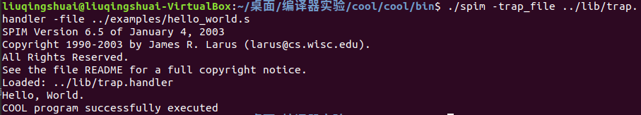

### **1.3-使用分析器编译cl文件**

**1.用标准的词法分析程序，编译一个Cool语言程序**

```
./reference-lexer ../examples/hello_world.cl
```

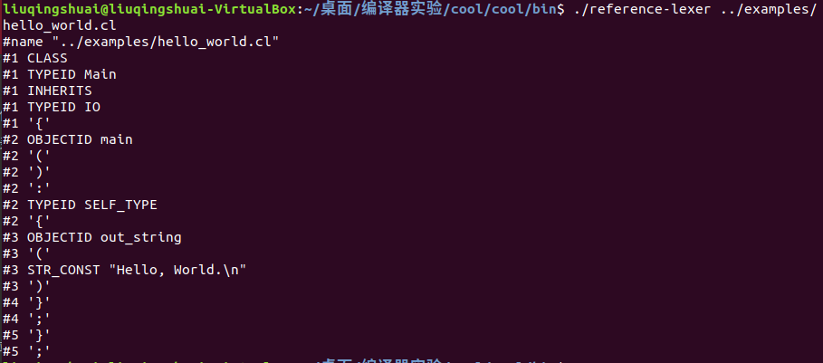

**2.用标准的词法分析程序和语法分析程序，编译一个Cool语言程序(通过管道流的方式)**

```
./reference-lexer ../examples/hello_world.cl|./reference-parser
```

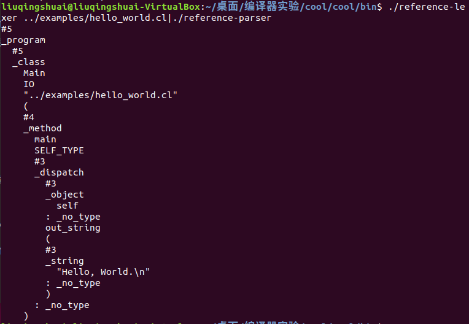

**3.用标准的词法分析程序，语法分析程序和语义分析程序编译一个Cool语言程序**

```
./reference-lexer ../examples/hello_world.cl|./reference-parser|./reference-semant
```

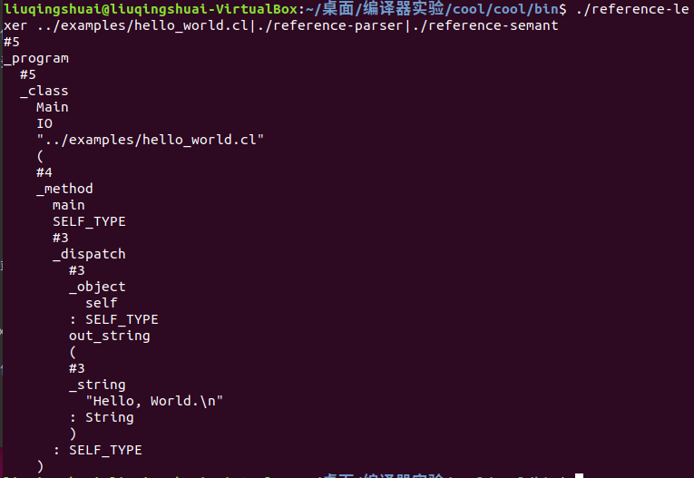

**4.用标准的词法分析程序，语法分析程序，语义分析程序和代码生成程序共同编译Cool语言程序，生成最终的汇编代码**

```
./reference-lexer ../examples/hello_world.cl | ./reference-parser | ./reference-semant | ./reference-cgen
```

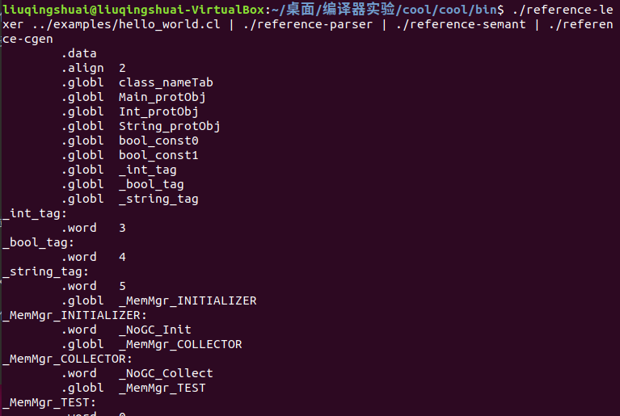

**5.将得到的汇编代码输出到`code.s`文件中，使用输出重定向符’>’**

```
./reference-lexer ../examples/hello_world.cl | ./reference-parser | ./reference-semant | ./reference-cgen > code.s
```

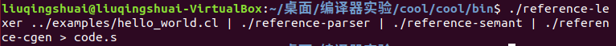

发现多了一个`code.s`

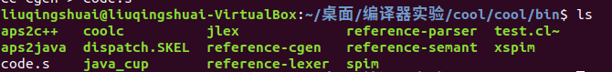

**6.将生成的汇编代码在spim上运行**

```
./spim -trap_file ../lib/trap.handler -file code.s
```

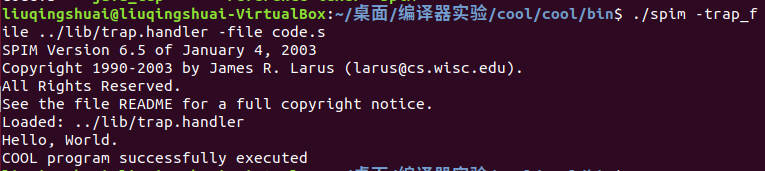

### 1.4-extra部分

:file_cabinet:add.cl：计算1到100的和

```cpp
class Main inherits IO{
  i:Int <- 1;
  ans:Int <- 0;
  main(): SELF_TYPE{{
    
    while(i<=100) loop{
      ans <- ans+i;
      i <- i+1;
    }pool;
    out_string("sum from 1 to 100 is : ");

    out_int(ans).out_string("\n");
    
  }};
};
```

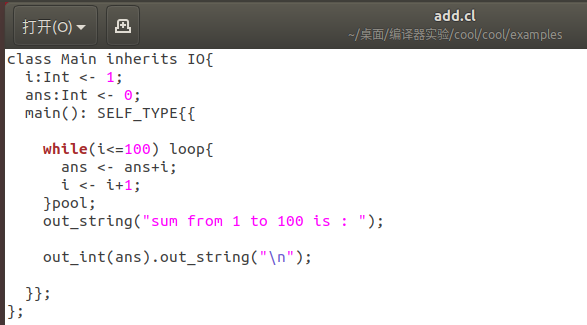

**编译并运行程序**

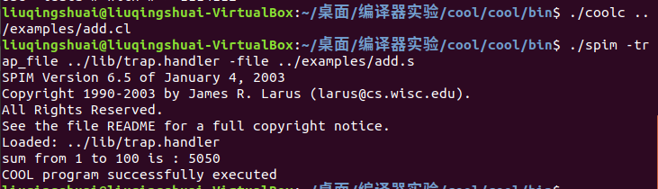

# 实验二、Cool堆栈机

### 2.1-修改makefile

**CLASSDIR**由`~/cool/cool`修改为`/home/liuqingshuai/桌面/编译器实验/cool/cool`

**SRC**由`demo.cl README.SKEL`修改为`stack.cl README.SKEL`

**demo、test、run**里面的demo均修改为stack

修改后如下


:file_cabinet:`stack.cl`代码如下

```
class A2I {

     c2i(char : String) : Int {
	if char = "0" then 0 else
	if char = "1" then 1 else
	if char = "2" then 2 else
        if char = "3" then 3 else
        if char = "4" then 4 else
        if char = "5" then 5 else
        if char = "6" then 6 else
        if char = "7" then 7 else
        if char = "8" then 8 else
        if char = "9" then 9 else
        { abort(); 0; }  -- the 0 is needed to satisfy the typchecker
        fi fi fi fi fi fi fi fi fi fi
     };

     i2c(i : Int) : String {
	if i = 0 then "0" else
	if i = 1 then "1" else
	if i = 2 then "2" else
	if i = 3 then "3" else
	if i = 4 then "4" else
	if i = 5 then "5" else
	if i = 6 then "6" else
	if i = 7 then "7" else
	if i = 8 then "8" else
	if i = 9 then "9" else
	{ abort(); ""; }  -- the "" is needed to satisfy the typchecker
        fi fi fi fi fi fi fi fi fi fi
     };

     a2i(s : String) : Int {
        if s.length() = 0 then 0 else
	if s.substr(0,1) = "-" then ~a2i_aux(s.substr(1,s.length()-1)) else
        if s.substr(0,1) = "+" then a2i_aux(s.substr(1,s.length()-1)) else
           a2i_aux(s)
        fi fi fi
     };

     a2i_aux(s : String) : Int {
	(let int : Int <- 0 in	
           {	
               (let j : Int <- s.length() in
	          (let i : Int <- 0 in
		    while i < j loop
			{
			    int <- int * 10 + c2i(s.substr(i,1));
			    i <- i + 1;
			}
		    pool
		  )
	       );
              int;
	    }
        )
     };

    i2a(i : Int) : String {
	if i = 0 then "0" else 
        if 0 < i then i2a_aux(i) else
          "-".concat(i2a_aux(i * ~1)) 
        fi fi
    };
			
    i2a_aux(i : Int) : String {
        if i = 0 then "" else 
	    (let next : Int <- i / 10 in
		i2a_aux(next).concat(i2c(i - next * 10))
	    )
        fi
    };

};

class List inherits IO
{
	isNil() : Bool 
	{
		{
			--out_string("list\n");
			true;
		}
	};
	
	head() : String
	{
		{
			abort();
			"";
		}
	};
	
	tail() : List
	{
		{
			abort();
			self;
		}
	};
	cons(i : String) : List
	{
		(new Cons).init(i, self)
	};
};

class Cons inherits List
{
	first : String;
	rest :  List;
	isNil() : Bool
	{
		{
			--out_string("cons\n");
			false;
		}
	};
	head() : String
	{	
		first
	};
	tail() : List
	{
		rest
	};
	init(head : String, next : List) : List
	{
		{
			first <- head;
			rest  <- next;
			self;
		}
	};
};


class Main inherits IO
{
	stack : List;
	
	newline() : Object
	{
		out_string("\n")
	};
	
	prompt() : String
	{
		{
			out_string(">");
			in_string();
		}
	};
	
	display_stack(s : List) : Object
	{
		{
			--out_string("hello\n");
			if s.isNil() then out_string("")
					else
					{
						out_string(s.head());
						out_string("\n");
						display_stack(s.tail());
					}
		fi;
		}
	};
	
	main():Object
	{
		( let z : A2I <- new A2I  , stack : List <- new List in
			while true loop
			( let s : String <- prompt() in
				if s = "x" then
					abort()
				else
					if s = "d"  then
						display_stack(stack)
					else
					    if s = "e"  then
							{
								if stack.isNil() then out_string("")
								
								else
								if stack.head() = "+" then
									{
										stack <- stack.tail();
										(let a : Int <- new Int, b : Int <- new Int in 	
											{
												--out_string(stack.head());
												a  <- z.a2i(stack.head());
												stack <- stack.tail();
												b  <- z.a2i(stack.head());
												stack <- stack.tail();
												a <- a + b;
												--out_string(z.i2a(a));
												stack <- stack.cons(z.i2a(a));
											}
										);
									}
								else
									if stack.head() = "s" then
										{
											stack <- stack.tail();
											(let a : String <- new String , b : String <- new String in 
												{
													a  <- stack.head();
													stack <- stack.tail();
													b  <- stack.head();
													stack <- stack.tail();
													stack <- stack.cons(a);
													stack <- stack.cons(b);
												}
											);
										}
									else
										out_string("")
									fi
									fi
								fi;
							}
						else
							stack <- stack.cons(s)
						fi
					fi
				fi
			)
			pool
		)
	};
};
```

### 2.2-编译测试

先把1、+、2、s压入栈

输入d展示一下栈

输入两个e，先把s弹出，然后计算出3

输入d，此时栈只有一个3

输入x，退出了

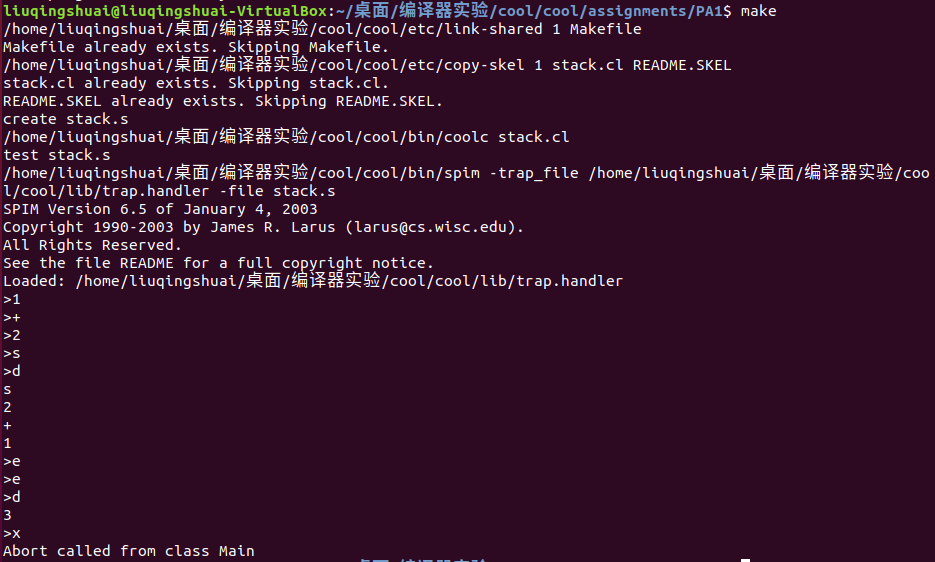

# 实验三、词法分析(上)

### 3.1-实现打印输入文字的行数，字数，字符数

:file_cabinet:`LexSamp1.l`如下

```
%{
    int numChar = 0;
    int numLine = 0;
    int numWord = 0;
%}

%%
[ \t]	/*匹配到tab或者空格，不用管*/

\n {numLine++;}	/*匹配到换行符，numLine加1*/

[^ \t\n]+ {numChar+=yyleng;numWord++;}	/*匹配到一个不包括tab、空格、换行符的字，numWord加1，numChar加上字符长度*/
%%

int yywrap(){}

int main(){
  yylex();
  printf("numChar=%d\nnumWord=%d\nnumLine=%d\n",numChar,numWord,numLine);
  return 0;
}
```

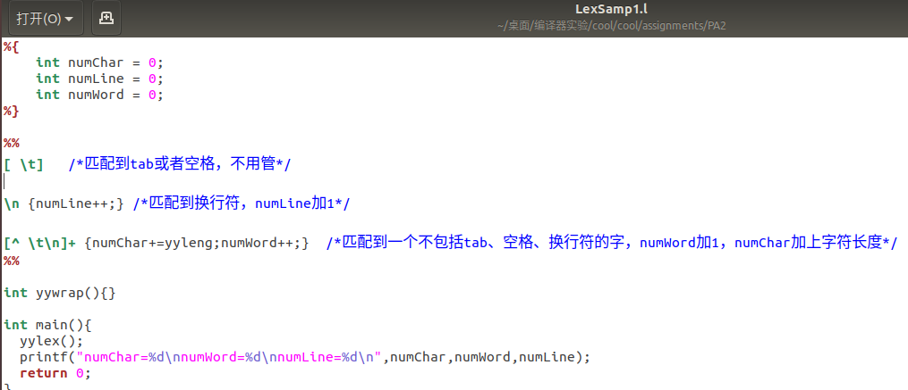

**将`LexSamp1.l`转换为C语言文件`lex.yy.c`然后编译执行**

```
flex LexSamp1.l
cc -o LexSamp1 lex.yy.c -ll
./LexSamp1
```

按`ctrl+d`结束

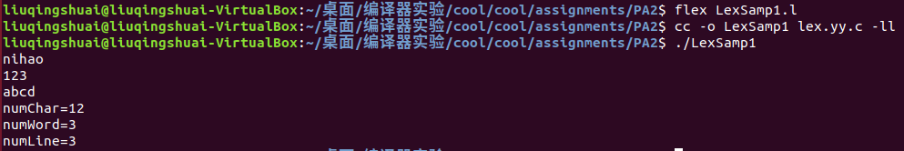

### 3.2-统计给定程序文件的行数，字数，以及关键字的个数

:file_cabinet:`LexSamp2.l`如下

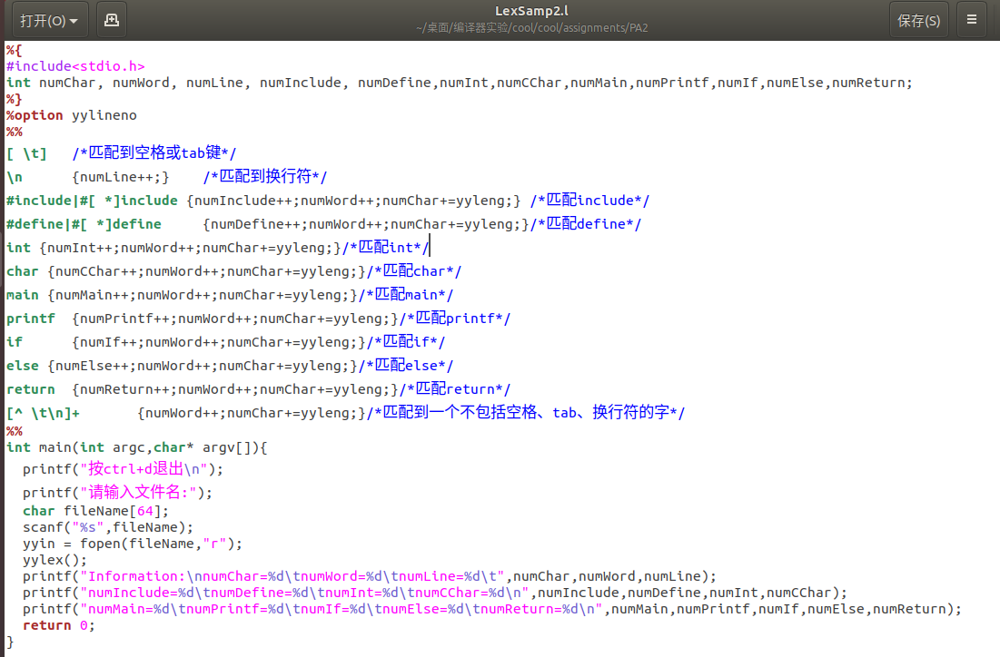

```c
%{
#include<stdio.h>
int numChar, numWord, numLine, numInclude, numDefine,numInt,numCChar,numMain,numPrintf,numIf,numElse,numReturn;
%}
%option yylineno
%%
[ \t]	/*匹配到空格或tab键*/
\n	{numLine++;}	/*匹配到换行符*/
#include|#[ *]include {numInclude++;numWord++;numChar+=yyleng;}	/*匹配include*/
#define|#[ *]define	{numDefine++;numWord++;numChar+=yyleng;}/*匹配define*/
int {numInt++;numWord++;numChar+=yyleng;}/*匹配int*/
char {numCChar++;numWord++;numChar+=yyleng;}/*匹配char*/
main {numMain++;numWord++;numChar+=yyleng;}/*匹配main*/
printf	{numPrintf++;numWord++;numChar+=yyleng;}/*匹配printf*/
if	{numIf++;numWord++;numChar+=yyleng;}/*匹配if*/
else {numElse++;numWord++;numChar+=yyleng;}/*匹配else*/
return	{numReturn++;numWord++;numChar+=yyleng;}/*匹配return*/
[^ \t\n]+	{numWord++;numChar+=yyleng;}/*匹配到一个不包括空格、tab、换行符的字*/
%%
int main(int argc,char* argv[]){
  printf("按ctrl+d退出\n");
  printf("请输入文件名:");
  char fileName[64];
  scanf("%s",fileName);
  yyin = fopen(fileName,"r");
  yylex();
  printf("Information:\nnumChar=%d\tnumWord=%d\tnumLine=%d\t",numChar,numWord,numLine);
  printf("numInclude=%d\tnumDefine=%d\tnumInt=%d\tnumCChar=%d\n",numInclude,numDefine,numInt,numCChar);
  printf("numMain=%d\tnumPrintf=%d\tnumIf=%d\tnumElse=%d\tnumReturn=%d\n",numMain,numPrintf,numIf,numElse,numReturn);
  return 0;
}
```

:file_cabinet:test2.c如下

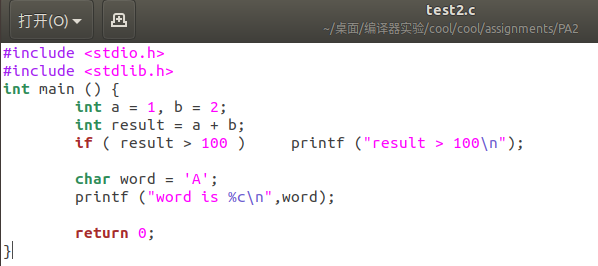

```c
#include <stdio.h>
#include <stdlib.h>
int main () {
	int a = 1, b = 2;
	int result = a + b;
	if ( result > 100 )	printf ("result > 100\n");

	char word = 'A';
	printf ("word is %c\n",word);

	return 0;
}
```

**将`LexSamp2.l`转换为C语言文件`lex.yy.c`然后编译执行**

```
flex LexSamp2.l
cc -o LexSamp2 lex.yy.c -;;
./LexSamp2
```


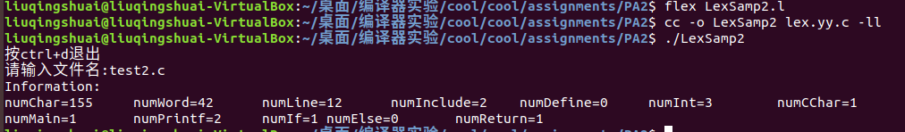

### 3.3-实现多重入口

:file_cabinet:`LexSamp4.l`如下

```c

%x AA BB CC
%%
^a		{ECHO; BEGIN AA;}
^b		{ECHO; BEGIN BB;}
^c		{ECHO; BEGIN CC;}
\n|(\t)+|" "+	{ECHO; BEGIN 0;}
<AA>magin 	{printf("first"); BEGIN 0;}
<AA>magin 	{printf("second"); BEGIN 0;}
<AA>magin 	{printf("third"); BEGIN 0;}
magic		{printf("zero");}
%%

int yywrap(){}

int main(){
    printf("按 ctrl+d 退出\n");
    yyLex();
    return 0;
}
```

```
flex -o LexSamp4.c LexSamp4.l
gcc -o LexSamp4 LexSamp4.c
./LexSamp4
```

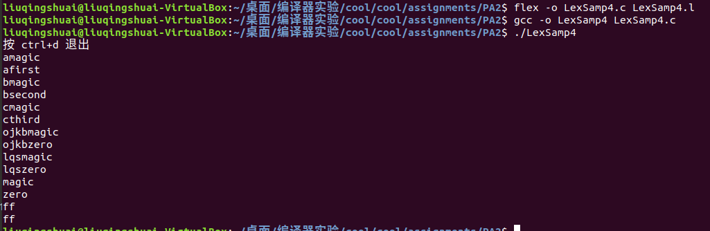

# 实验四、词法分析(下)

### 4.1-修改makefile

**CLASSDIR**由`/home/os/cool/cool`修改为`/home/liuqingshuai/桌面/编译器实验/cool/cool`

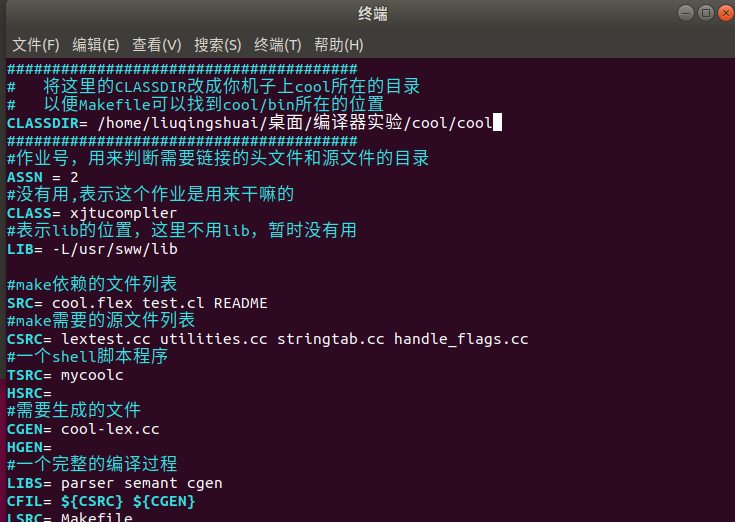

###  4.2-补充`cool.flex`

:file_cabinet:`cool.flex`(修改如下最开始两个词法分析器的输出是不同的，这里就不贴图了，直接修改`cool.flex`)

```
 /*
  *  这个文件用来生成一个COOL语言的词法分析程序.
  */

 /*
  *  lex文件的第一个部分，也就是包含在“%{”和“ %}”之间的部分，是用来像未来的词法分析程序输出代
  *  码的，也就是说这里的需要include头文件，extern外部变量，因为这部分是要直接照搬到以后的.c文
  *  件中去的 
  */
%{

#include <cool-parse.h>	//记号的定义放在cool-parse.h文件中
#include <stringtab.h>
#include <utilities.h>
#include <stdint.h>

/* 词法分析程序需要的宏定义 */
#define yylval cool_yylval
#define yylex  cool_yylex

/* 字符串常量的最大长度 */
#define MAX_STR_CONST 1025
#define YY_NO_UNPUT   /* 让g++的编译结果变得友好 */

extern FILE *fin; /* 从这个文件指针读取记号 */

/* 定义YY_INPUT以后我们就可以从fin中读取记号了:
 */
#undef YY_INPUT
#define YY_INPUT(buf,result,max_size) \
	if ( (result = fread( (char*)buf, sizeof(char), max_size, fin)) < 0) \
		YY_FATAL_ERROR( "read() in flex scanner failed");

char string_buf[MAX_STR_CONST]; /* 记录字符串的字符数组*/
char *string_buf_ptr;

extern int curr_lineno;
extern int verbose_flag;

extern YYSTYPE cool_yylval;

/*
 *  在这里添加你自己的头文件和变量
 */

char string_const[MAX_STR_CONST];
int string_const_len;
bool str_contain_null_char;

%}

 /*
  * 定义正则表达式的名字
  */

%option noyywrap
%x LINE_COMMENT BLOCK_COMMENT STRING

DARROW			=>
ASSIGN			<-
LE				<=

%%

\n				{ curr_lineno++; }
[ \t\r\v\f]+	{}
 
/*
 * 第二部分用来定义正则表达式需要的“元素”
 */

"--"			{ BEGIN LINE_COMMENT; }
"(\*"			{ BEGIN BLOCK_COMMENT; }
"\*)"			{
	strcpy(cool_yylval.error_msg, "Unmatched *)");
	return (ERROR);
}

<LINE_COMMENT>\n		{ BEGIN 0; curr_lineno++; }
<BLOCK_COMMENT>\n		{ curr_lineno++; }
<BLOCK_COMMENT>"\*)"	{ BEGIN 0; }
<BLOCK_COMMENT><<EOF>>	{ 
	strcpy(cool_yylval.error_msg, "EOF in comment");
	BEGIN 0; return (ERROR);
}

<LINE_COMMENT>.			{}
<BLOCK_COMMENT>.		{}

 /*
  *  多字符操作符
  */

{DARROW}		{ return (DARROW); }
{ASSIGN}		{ return (ASSIGN); }
{LE}			{ return (LE); }

 /*
  *  单字符操作符
  */

"{"			{ return '{'; }
"}"			{ return '}'; }
"("			{ return '('; }
")"			{ return ')'; }
"~"			{ return '~'; }
","			{ return ','; }
";"			{ return ';'; }
":"			{ return ':'; }
"+"			{ return '+'; }
"-"			{ return '-'; }
"*"			{ return '*'; }
"/"			{ return '/'; }
"%"			{ return '%'; }
"."			{ return '.'; }
"<"			{ return '<'; }
"="			{ return '='; }
"@"			{ return '@'; }

 /*
  * 关键字
  */

(?i:CLASS)		{ return (CLASS); }
(?i:ELSE)		{ return (ELSE); }
(?i:FI)			{ return (FI); }
(?i:IF)			{ return (IF); }
(?i:IN)			{ return (IN); }
(?i:INHERITS)	{ return (INHERITS); }
(?i:LET)		{ return (LET); }
(?i:LOOP)		{ return (LOOP); }
(?i:POOL)		{ return (POOL); }
(?i:THEN)		{ return (THEN); }
(?i:WHILE)		{ return (WHILE); }
(?i:CASE)		{ return (CASE); }
(?i:ESAC)		{ return (ESAC); }
(?i:OF)			{ return (OF); }
(?i:NEW)		{ return (NEW); }
(?i:LE)			{ return (LE); }
(?i:NOT)		{ return (NOT); }
(?i:ISVOID)		{ return (ISVOID); }

t[rR][uU][eE]		{ 
	cool_yylval.boolean = 1;
	return (BOOL_CONST);
}

f[aA][lL][sS][eE]	{ 
	cool_yylval.boolean = 0;
	return (BOOL_CONST);
}

 /*
  *  字符串
  *
  */

\"	{
	memset(string_const, 0, sizeof string_const);
	string_const_len = 0; str_contain_null_char = false;
	BEGIN STRING;
}

<STRING><<EOF>>	{
	strcpy(cool_yylval.error_msg, "EOF in string constant");
	BEGIN 0; return (ERROR);
}

<STRING>\\.		{
	if (string_const_len >= MAX_STR_CONST) {
		strcpy(cool_yylval.error_msg, "String constant too long");
		BEGIN 0; return (ERROR);
	} 
	switch(yytext[1]) {
		case '\"': string_const[string_const_len++] = '\"'; break;
		case '\\': string_const[string_const_len++] = '\\'; break;
		case 'b' : string_const[string_const_len++] = '\b'; break;
		case 'f' : string_const[string_const_len++] = '\f'; break;
		case 'n' : string_const[string_const_len++] = '\n'; break;
		case 't' : string_const[string_const_len++] = '\t'; break;
		case '0' : string_const[string_const_len++] = 0; 
			   str_contain_null_char = true; break;
		default  : string_const[string_const_len++] = yytext[1];
	}
}

<STRING>\\\n	{ curr_lineno++; }
<STRING>\n		{
	curr_lineno++;
	strcpy(cool_yylval.error_msg, "Unterminated string constant");
	BEGIN 0; return (ERROR);
}

<STRING>\"		{ 
	if (string_const_len > 1 && str_contain_null_char) {
		strcpy(cool_yylval.error_msg, "String contains null character");
		BEGIN 0; return (ERROR);
	}
	cool_yylval.symbol = stringtable.add_string(string_const);
	BEGIN 0; return (STR_CONST);
}

<STRING>.		{ 
	if (string_const_len >= MAX_STR_CONST) {
		strcpy(cool_yylval.error_msg, "String constant too long");
		BEGIN 0; return (ERROR);
	} 
	string_const[string_const_len++] = yytext[0]; 
}

 /*
  *  数字和标识符
  */

[0-9]+				{ 
	cool_yylval.symbol = inttable.add_string(yytext); 
	return (INT_CONST);
}

[A-Z][A-Za-z0-9_]*	{
	cool_yylval.symbol = idtable.add_string(yytext);
	return (TYPEID);
}

[a-z][A-Za-z0-9_]*	{
	cool_yylval.symbol = idtable.add_string(yytext);
	return (OBJECTID);
}

 /*
  *  其他错误
  */

.	{
	strcpy(cool_yylval.error_msg, yytext); 
	return (ERROR); 
}

%%
```

### 4.3-使用make指令生成的lexer进行词法分析

```
make lexer
ls
make dotest
```

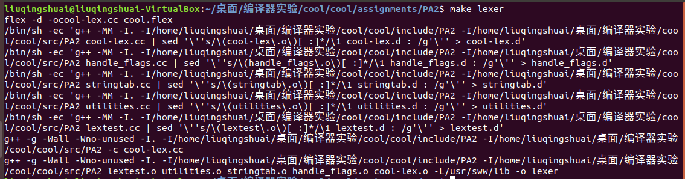

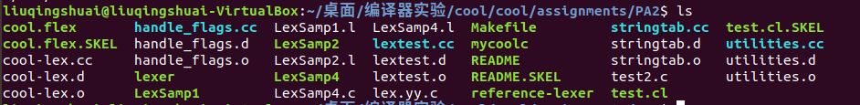

<div>
  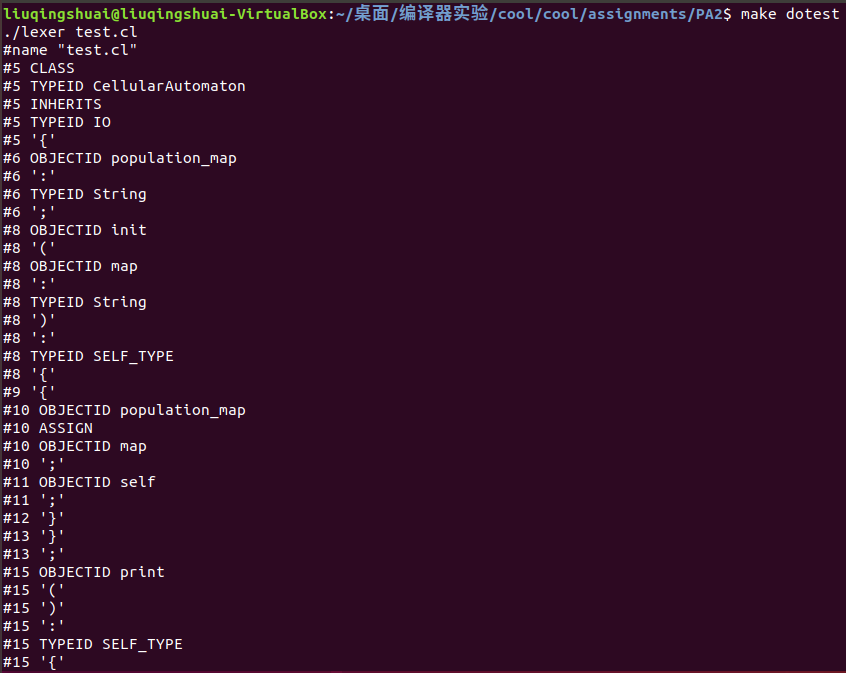
  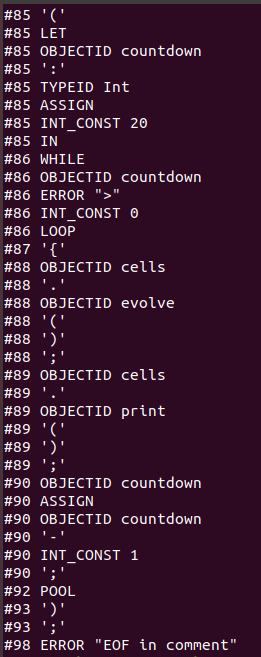
</div>

### 4.4-使用标准词法分析器进行分析

```
./reference-lexer test.cl
```

<div>
  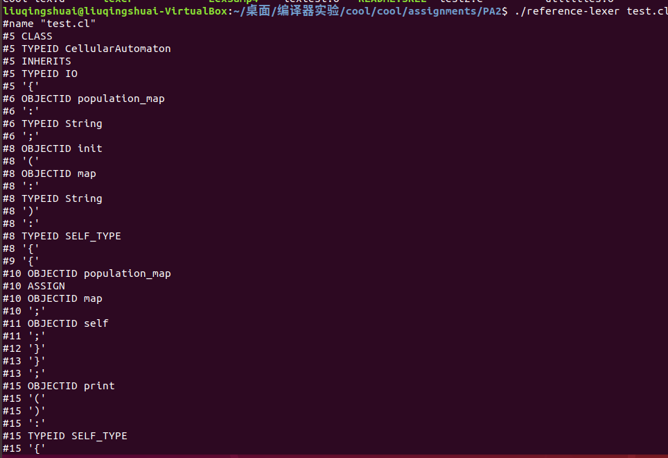
  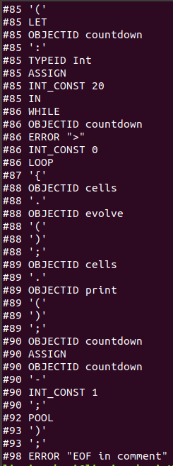
</div>

### 4.5-对比

对比上面两个词法分析器，二者输出结果相同，都对目标代码进行了词法分析。

### 4.6-错误处理

由于`test.cl`实际上有问题，因此修改一下`test.cl`，将93行的注释补齐如下，左侧为原本，右侧为修改后

<div>
  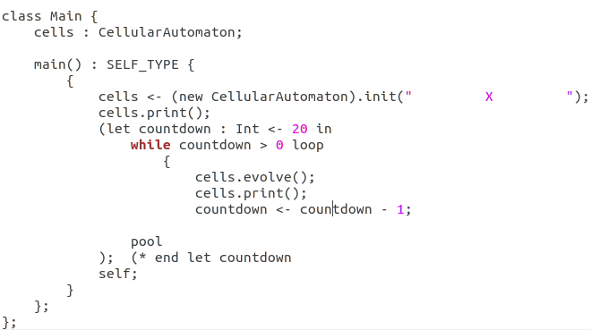
  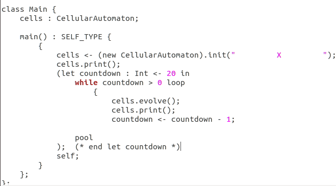
</div>

然后再次执行

```
make dotest
```

<div>
  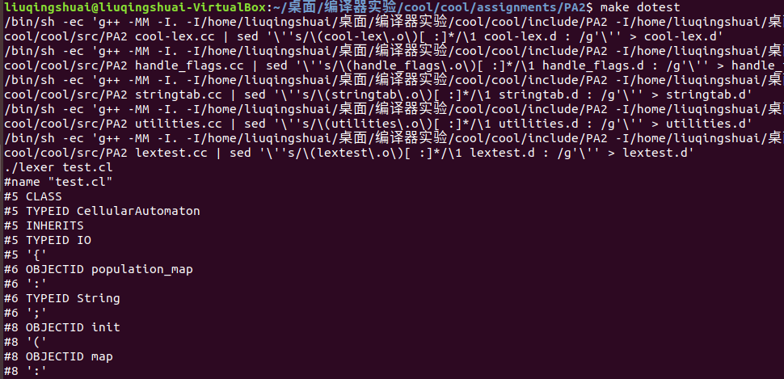
  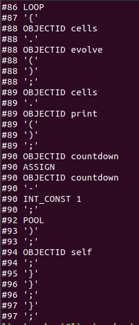
</div>

这次便没有了之前的`ERROR "EOF IN COMMENT" `

# 实验五、语义分析和语法制导

### 5.1&5.2-编写一个简单的.y文件，能实现一个简单的一位数十进制计算器，包括加减乘除，并能识别负数

:file_cabinet:`token.l`文件如下

```
%{
#include "y.tab.h"
%}

%%
[0-9]+ {yylval=atoi(yytext); return T_NUM;}
[-/+*()\n] {return yytext[0];}
. {return 0;}
%%

int yywrap(){
return 1;
}
```

:file_cabinet: `parser1.y`文件如下

```
%{
#include<stdio.h>
extern int yylex();
extern int yyparse();
void yyerror(const char* msg){}
%}

%token T_NUM
%left '+' '-'
%left '*' '/'
%right uminus

%%
S: S E '\n' {printf("ans=%d\n",$2);}
 |          {  }
 ;

E: E '+' E {$$=$1+$3;}
 | E '-' E {$$=$1-$3;}
 | E '*' E {$$=$1*$3;}
 | E '/' E {$$=$1/$3;}
 | T_NUM {$$=$1;}
 | '(' E ')' {$$=$2;}
 | '-' E %prec uminus {$$=-$2;}
 ;
%%

int main (){
return yyparse();
}
```

<div>
  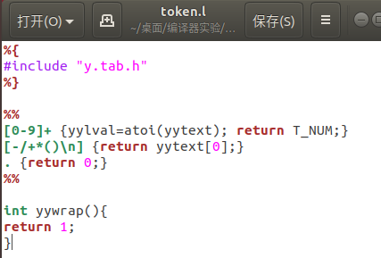
  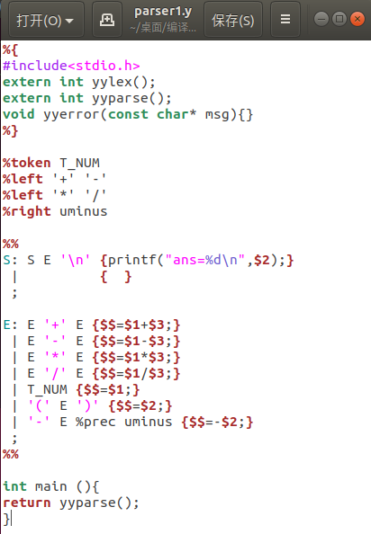
</div>

```
bison -vtdy parser1.y | flex token.l
gcc -o calculate1 lex.yy.c y.tab.c
./calculate1
```

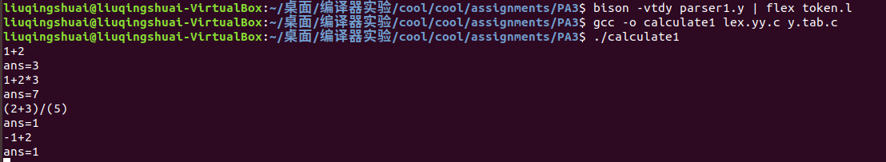

### 5.3-在任务2的基础上实现多位数字的处理，并增加报错功能（选做）

`parser2.y`如下

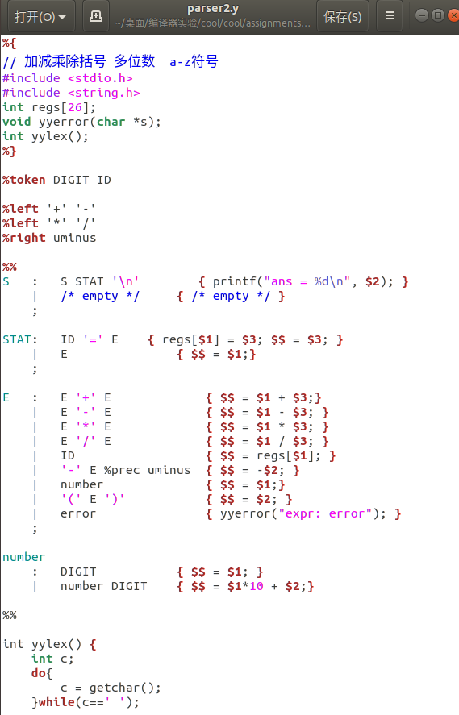

```
bison -d parser2.y
gcc -o calculate2 parser2.tab.c
./calculate2
```

实现了赋值和报错

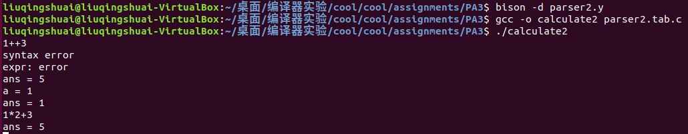

# 实验六、语法分析

### 6.1-修改makefile

修改`CLASSDIR`

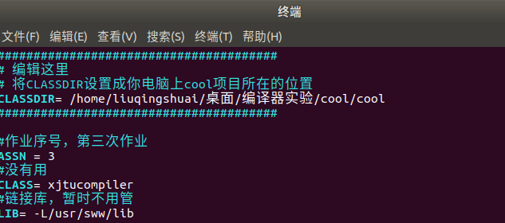

### 6.2-编写一个cool.y文件

:file_cabinet:`cool.y`文件如下(去掉了注释)

```c
%{
#include <iostream>
#include "cool-tree.h"
#include "stringtab.h"
#include "utilities.h"

extern char *curr_filename;

void yyerror(char *s);        /*  defined below; called for each parse error */
extern int yylex();           /*  the entry point to the lexer  */

Program ast_root;	      /* the result of the parse  */
Classes parse_results;        /* for use in semantic analysis */
int omerrs = 0;               /* number of errors in lexing and parsing */
%}

%union {
  Boolean boolean;
  Symbol symbol;
  Program program;
  Class_ class_;
  Classes classes;
  Feature feature;
  Features features;
  Formal formal;
  Formals formals;
  Case case_;
  Cases cases;
  Expression expression;
  Expressions expressions;
  char *error_msg;
}

%token CLASS 258 ELSE 259 FI 260 IF 261 IN 262 
%token INHERITS 263 LET 264 LOOP 265 POOL 266 THEN 267 WHILE 268
%token CASE 269 ESAC 270 OF 271 DARROW 272 NEW 273 ISVOID 274
%token <symbol>  STR_CONST 275 INT_CONST 276 
%token <boolean> BOOL_CONST 277
%token <symbol>  TYPEID 278 OBJECTID 279 
%token ASSIGN 280 NOT 281 LE 282 ERROR 283

%type <program> program
%type <classes> class_list
%type <class_> class

%type <features> dummy_feature_list


%%
program	: class_list	{ ast_root = program($1); }
        ;

class_list
	: class			/* single class */
		{ $$ = single_Classes($1);
                  parse_results = $$; }
	| class_list class	/* several classes */
		{ $$ = append_Classes($1,single_Classes($2)); 
                  parse_results = $$; }
	;

class	: CLASS TYPEID '{' dummy_feature_list '}' ';'
		{ $$ = class_($2,idtable.add_string("Object"),$4,
			      stringtable.add_string(curr_filename)); }
	| CLASS TYPEID INHERITS TYPEID '{' dummy_feature_list '}' ';'
		{ $$ = class_($2,$4,$6,stringtable.add_string(curr_filename)); }
	;

dummy_feature_list:		/* empty */
                {  $$ = nil_Features(); }
	;

%%

void yyerror(char *s)
{
  extern int curr_lineno;

  cerr << "\"" << curr_filename << "\", line " << curr_lineno << ": " \
    << s << " at or near ";
  print_cool_token(yychar);
  cerr << endl;c
  omerrs++;

  if(omerrs>50) {fprintf(stdout, "More than 50 errors\n"); exit(1);}
}
```

### 6.3-根据cool语言的标准文法完成cool语言语法分析，输出语法分析树结果

```
make
```

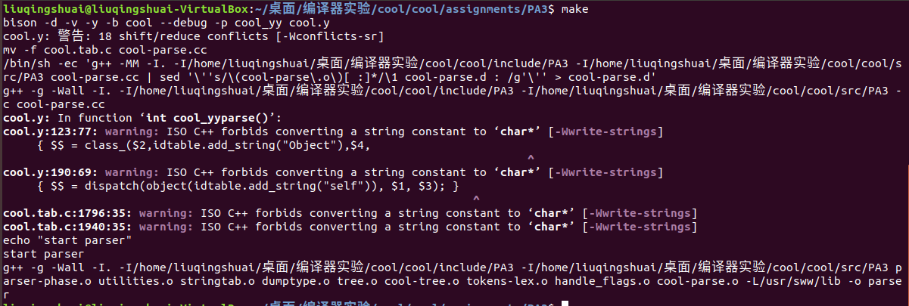

```
../../bin/reference-lexer good.cl | ../../bin/reference-parser
```


```
../../bin/reference-lexer good.cl | ./parser
```

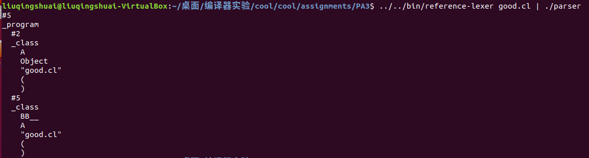


`make`生成的`parser`和标准语法分析器二者对`good.cl`的分析树结果是相同的


### 6.4-对bad.cl也进行语法分析

```
../../bin/reference-lexer bad.cl | ../../bin/reference-parser
../../bin/reference-lexer bad.cl | ./parser
```

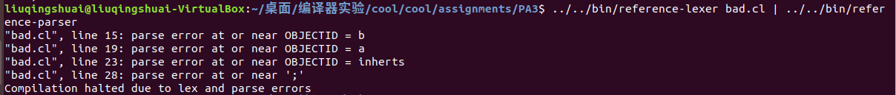

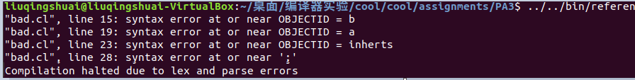

两个分析器对`bad.cl`的语法分析结果也是相同的


# 实验七、语义分析

### 7.1-修改makefile

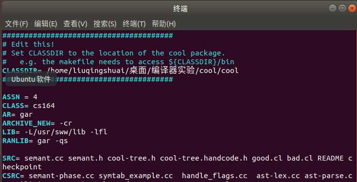

### 7.2-删掉只包含路径的文件，只剩下下列文件，编译器运行

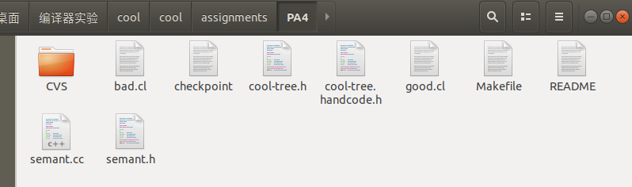

执行下面操作

```
make
./lexer good.cl
./lexer good.cl | ./parser
./lexer good.cl | ./parser | ./semant
```

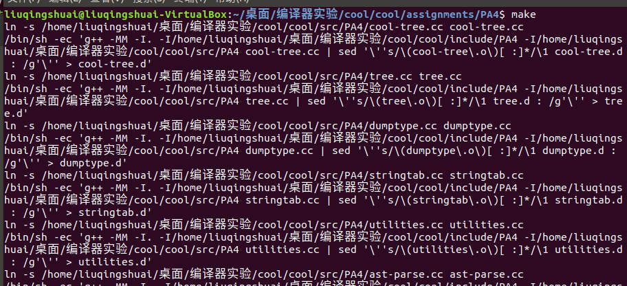

<div>
  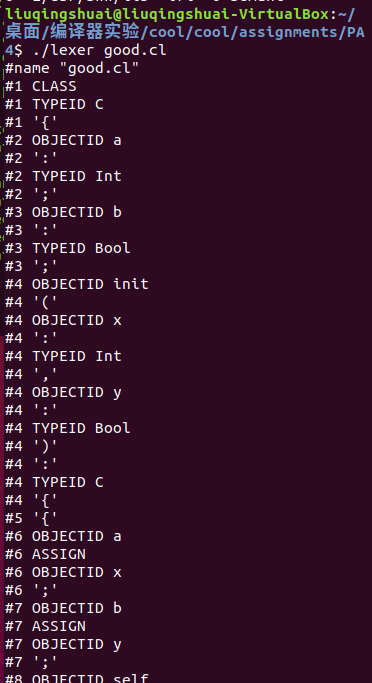
  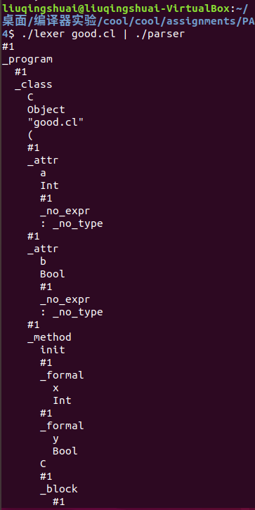
  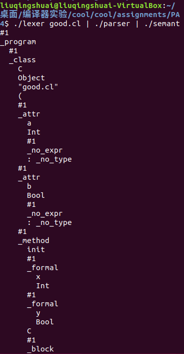
</div>


```
./lexer bad.cl
./lexer bad.cl | ./parser
./lexer bad.cl | ./parser | ./semant
```

<div>
  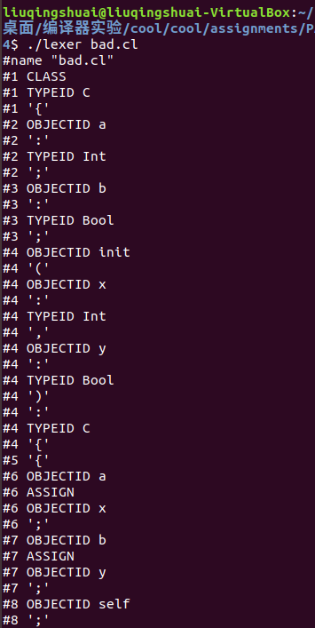
  
  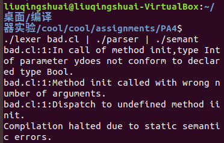
</div>

### 7.3-测试符号表结构

```
make symtab_example
./symtab_example
```

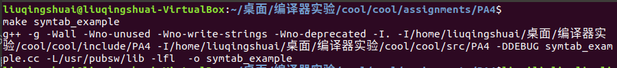

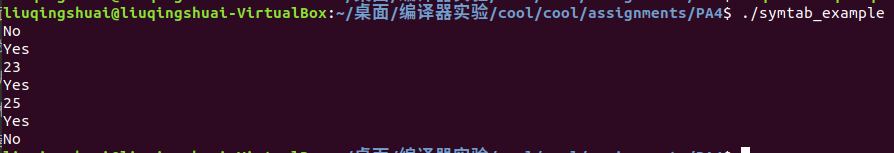

### 7.4-遍历classes实例

:file_cabinet:`semant.cc`如下

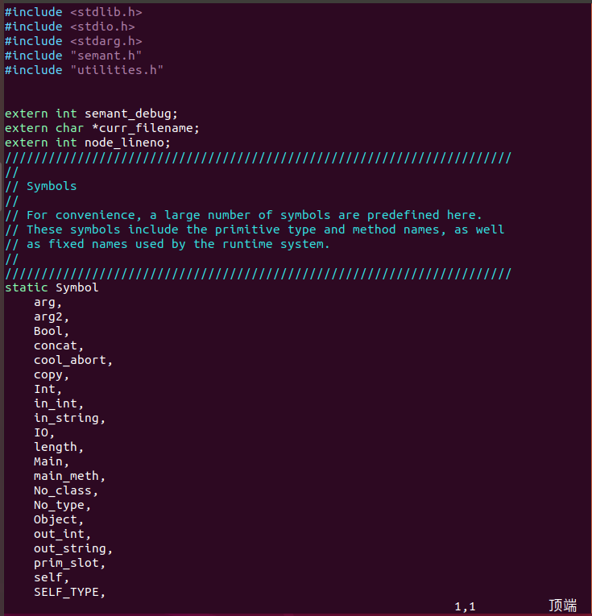
